# Progressive Web Applications with Angular and Spring Boot

Progressive Web Applications are becoming increasingly popular in web development. If you search for information on Progressive Web Applications (PWAs), you'll find that most of the information comes from Google and its network of Google Developer Experts. This isn't surprising as Google is often promoting the latest and greatest web technologies. They also develop their own browser, Chrome, which makes it possible to use many of the new standards in HTML5, JavaScript and beyond.

Progressive Web Applications are those that leverage [Transport Layer Security](https://en.wikipedia.org/wiki/Transport_Layer_Security) (TLS), webapp manifests and service workers to make an application installable with offline capabilities. In other words, a PWA is like a native app on your phone, but it's built with web technologies like HTML5, JavaScript, and CSS3. If built right, a PWA is indistinguishable from a native application.

You might ask, why is this important? Alex Russell recently stated "we've failed on mobile" when talking about [Adapting to the Mobile Present](https://www.youtube.com/watch?v=K1SFnrf4jZo&feature=youtu.be). In his talk, he mentions a DoubleClick report that found 53% of visits are abandoned if a mobile site takes more than 3 seconds to load. That same report said the average mobile sites load in 19 seconds. Russell says one of the biggest problems is developers use powerful laptops and desktops to develop their mobile applications, rather than using a $200 device on a 3G connection. Using this environment is "ground truth" the majority of web users in the world. It's cool to develop native applications, but people with slow phones and internet don't want to download a 60MB app, they just want to use the web. PWAs are one of the easiest ways to make web applications faster and easier to use, allowing developers to build a better internet for everyone.

To fight back and build better mobile apps, Russell recommends five techniques:

1. Implement the PRPL pattern
2. Get a ~$150-200 unlocked Android (e.g. Moto G4)
3. Use chrome://inspect && chrome://inspect?tracing
4. Install [Lighthouse](https://github.com/GoogleChrome/lighthouse) and use it to analyze your applications
5. Use Chrome DevTools Network and CPU Throttling

Google engineer Addy Osmani describes [the PRPL pattern](https://developers.google.com/web/fundamentals/performance/prpl-pattern/) in an article on Google's Web Fundamentals site.

> PRPL is a pattern for structuring and serving Progressive Web Apps (PWAs), with an emphasis on the performance of app delivery and launch. It stands for:

> * **Push** critical resources for the initial URL route.
> * **Render** initial route.
> * **Pre-cache** remaining routes.
> * **Lazy-load** and create remaining routes on demand.

The [Progressive Web App Checklist](https://developers.google.com/web/progressive-web-apps/checklist) lists all the things you'll need to make a progressive webapp. However, I like the simple list that Alex Russell lists on [What, Exactly, Makes Something A Progressive Web App?](https://infrequently.org/2016/09/what-exactly-makes-something-a-progressive-web-app/).

<!--
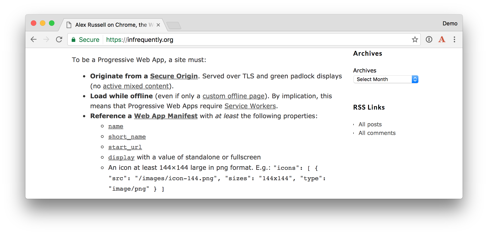
-->


This article will show you how to build a PWA with a Spring Boot backend and an Angular frontend. It'll work offline and I'll show how to deploy it to the cloud.

## Run a Spring Boot API

In [part 1 of this series](TBD), I showed you how to create an API with Spring Boot and display its data in an Angular UI. You'll be using that project as a starting point for this tutorial. You'll adding offline capabilities by turning it into a PWA.

To begin, clone the project from GitHub.

<pre>
git clone https://github.com/oktadeveloper/spring-boot-angular-example.git
</pre>

Open the "server" project in your favorite IDE and run `DemoApplication` or start it from the command line using `./mvnw spring-boot:run`. 

Re-build your application and navigate to [http://localhost:8080/good-beers](http://localhost:8080/good-beers). You should see the list of good beers in your browser.


You can also see the result in your terminal window using HTTPie.

<pre>
http localhost:8080/good-beers
</pre>

## Progressive Web Apps with Angular

I started my PWAs learning journey while sitting in a conference session with [Josh Crowther](https://twitter.com/jshcrowthe) at [The Rich Web Experience](https://stormpath.com/blog/angular-and-microservices-rich-web-experience-2016). His [Progressive Web Apps: The Future of the Web](bit.ly/2haHF1y) presentation taught me everything I needed to know to get started. However, his examples used Polymer and I wanted to create a PWA with Angular.
 
When I first started researching how to build PWAs with Angular, I found [mobile.angular.io](https://mobile.angular.io). 

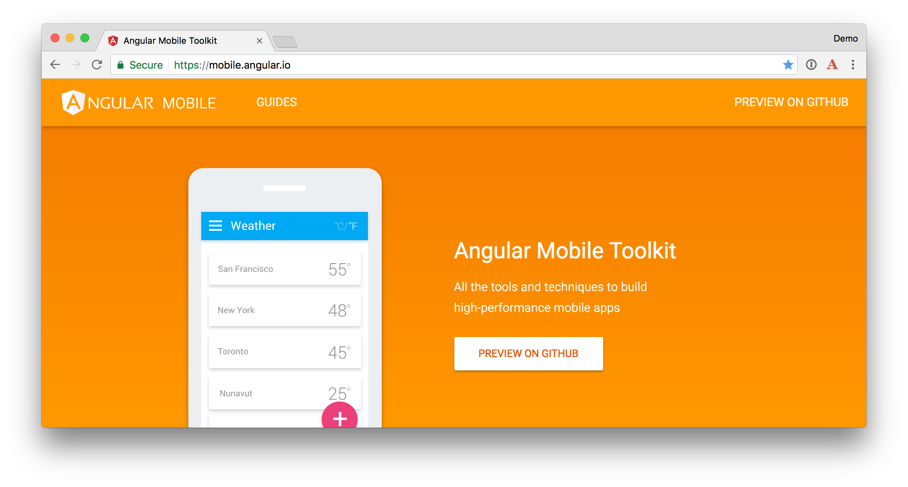

This website seemed to be exactly what I needed and I was pumped to find a tutorial showing [how to build a PWA with Angular CLI](https://github.com/angular/mobile-toolkit/blob/master/guides/cli-setup.md). After installing Angular CLI, I tried the tutorial's recommended first step:

<pre>
ng new hello-mobile --mobile
</pre>

I was disappointed to find the latest version of Angular CLI (1.0.0) does not support the mobile flag. 

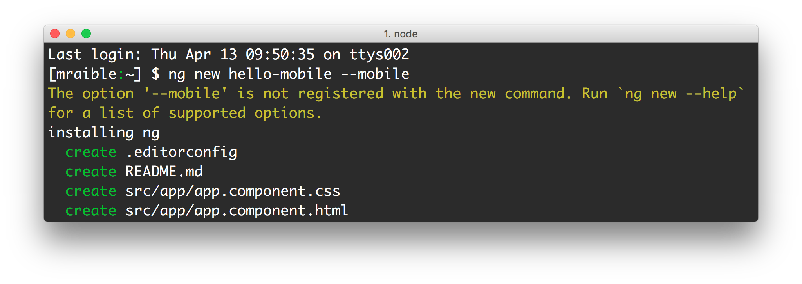

After searching through the project's GitHub issues, I [found a reference](https://github.com/angular/mobile-toolkit/issues/109) to [Maxim Salnikov](https://twitter.com/webmaxru)'s [PWA demo app](https://github.com/webmaxru/pwa-guide-ngpoland/tree/step-dashboard). Maxim created this repo as part of a half-day workshop at [ngPoland](http://ng-poland.pl/) and the project's `README` said to contact him for workshop instructions. I emailed Maxim and he politely shared his [Angular 2 PWA Workshop instructions](bit.ly/pwa-ngpoland) and [slides](http://slides.com/webmax/pwa-ngpoland#/).

**NOTE:** Since then, Maxim as created a new guide called [Progressive Web Apps using the Angular Mobile Toolkit](http://bit.ly/pwa-ng-nl).

## Transform your Angular App to be a PWA

There are a number of steps you need to perform to make the Angular client work offline and be a PWA. 

1. Add Angular Material
2. Create and register a Service Worker
3. Create an App Shell
4. Add a manifest to make it installable

### Add Angular Material

Installing [Angular Material](https://material.angular.io/) is not a necessary step, but it will make the client look much nicer. Make sure you're in the `client` directory, then install it using npm.

<pre>
npm install --save @angular/material
</pre>

Add `MaterialModule` as an import in `app.module.ts`:

```typescript
import { MaterialModule } from '@angular/material';

@NgModule({
  ...
  imports: [
    ...
    MaterialModule
  ]
```

Add Material icons and a theme to `styles.css`:

```css
@import '~https://fonts.googleapis.com/icon?family=Material+Icons';
@import '~@angular/material/core/theming/prebuilt/deeppurple-amber.css';

body {
  margin: 0;
  font-family: Roboto, sans-serif;
}
```

Change the HTML templates to use Material components. For `app.component.html`, you can change the `<h1>` to be an `<md-toolbar>`.

```html
<md-toolbar color="primary">
  <span>{{title}}</span>
</md-toolbar>

<app-beer-list></app-beer-list>
```

In `beer-list.component.html`, change it to use `<md-list>` and its related components.

```html
<h2>Beer List</h2>

<md-list>
  <md-list-item *ngFor="let b of beers">
    
    <h3 md-line>
      {{b.name}}
    </h3>
  </md-list-item>
</md-list>
```

After making these changes, the app should look a little better. Below is a screenshot using Chrome's device toolbar.

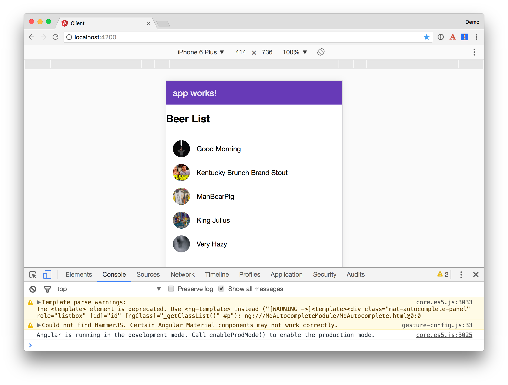 

To prove that there's still work to do, you'll notice that if you toggle offline mode in the Network tab of Chrome's developer tools, the app does not work.

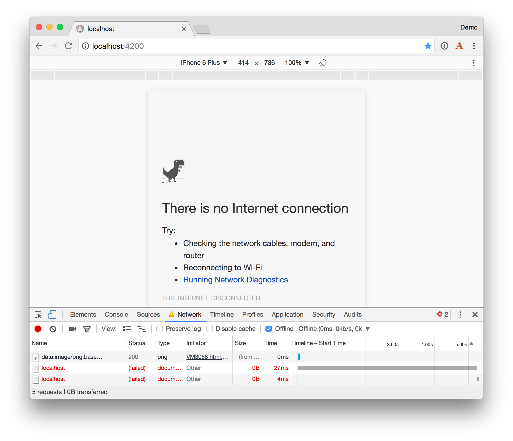 

### Create and Register a Service Worker

To create a service worker, start by creating a `src/sw.js` file that logs when events have been triggered.

```js
self.addEventListener('install', (e) => {
  console.log('Service Worker: Installed');
});

self.addEventListener('activate', (e) => {
  console.log('Service Worker: Active');
});

self.addEventListener('fetch', (e) => {
  console.log('Service Worker: Fetch');
});
```

Register this service worker by adding the following to `index.html`.

```html
<script defer>
  if (navigator.serviceWorker) {
    navigator.serviceWorker.register('sw.js').then(() => {
      console.log('Service worker installed')
    }, err => {
      console.error('Service worker error:', err);
    });
  }
</script>
```

<div style="border: 1px solid silver; background: #eee; padding: 10px; margin-bottom: 10px">
<strong>TIP</strong>: If you have issues with pasting the JavaScript above into IntelliJ, you may need to set the default JavaScript language version to ECMAScript 6. You can do this under <b>Preferences</b> > <b>Languages & Frameworks</b> > <b>JavaScript</b>.

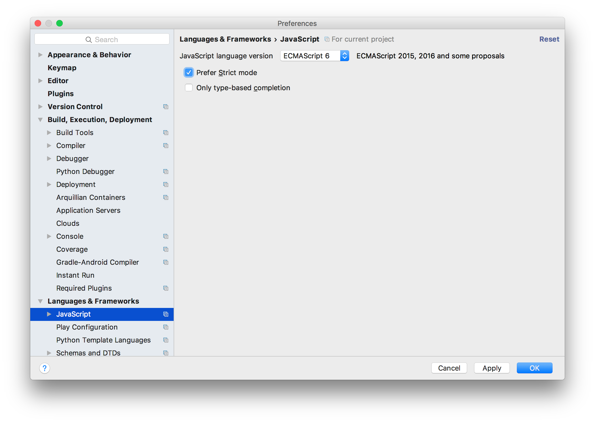
</div>

After making these changes, you should see log messages in your console.

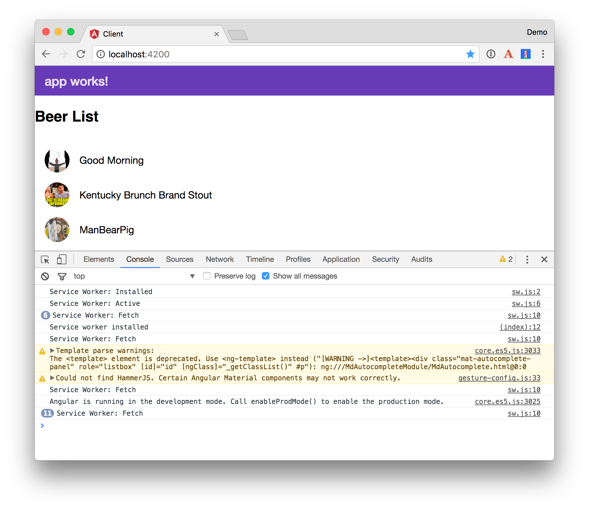

You can also go to **DevTools** > **Application** > **Service Workers** to see that it's been registered.

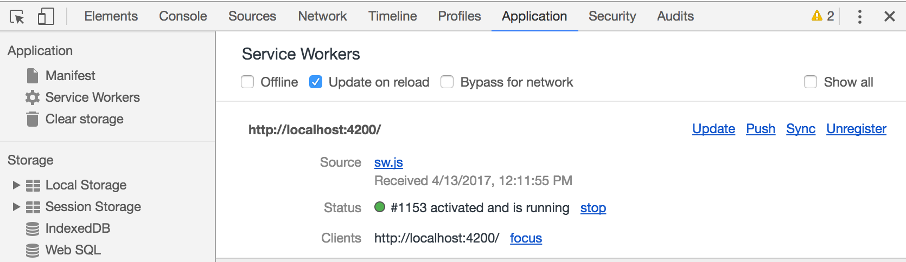

**TIP:** To ensure the service worker gets updated with each page refresh, check the "Update on reload" checkbox.

The goal of adding PWA features to a webapp is to make sure it starts fast. To make this possible, you want to make sure all the resources are cached by the service worker and they're sent to the page without a network request. To make this work, replace the contents of `sw.js` with the following file that caches local resources and network requests.

```js
let log = console.log.bind(console);
let err = console.error.bind(console);

let version = '1';
let cacheName = 'pwa-client-v' + version;
let dataCacheName = 'pwa-client-data-v' + version;
let appShellFilesToCache = [
  './',
  './index.html',
  './inline.bundle.js',
  './styles.bundle.js',
  './vendor.bundle.js',
  './main.bundle.js'
];

self.addEventListener('install', (e) => {
  e.waitUntil(self.skipWaiting());
  log('Service Worker: Installed');

  e.waitUntil(
    caches.open(cacheName).then((cache) => {
      log('Service Worker: Caching App Shell');
      return cache.addAll(appShellFilesToCache);
    })
  );
});

self.addEventListener('activate', (e) => {
  e.waitUntil(self.clients.claim());
  log('Service Worker: Active');

  e.waitUntil(
    caches.keys().then((keyList) => {
      return Promise.all(keyList.map((key) => {

        if (key !== cacheName) {
          log('Service Worker: Removing old cache', key);
          return caches.delete(key);
        }

      }));
    })
  );
});

self.addEventListener('fetch', (e) => {
  log('Service Worker: Fetch URL ', e.request.url);

  // Match requests for data and handle them separately
  e.respondWith(
    caches.match(e.request.clone()).then((response) => {
      return response || fetch(e.request.clone()).then((r2) => {
          return caches.open(dataCacheName).then((cache) => {
            console.log('Service Worker: Fetched & Cached URL ', e.request.url);
            cache.put(e.request.url, r2.clone());
            return r2.clone();
          });
        });
    })
  );
});
```

After making this change and refreshing, you'll notice that caches are created for both local assets.

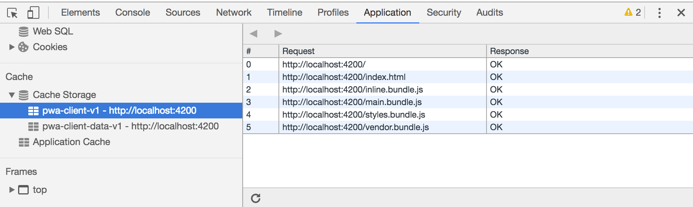 

And for network requests.

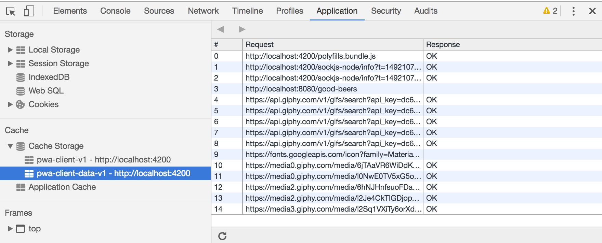 

### Create an App Shell
Angular App Shell is a project that provides `shellRender` and `shellNoRender` directives. Using these directives, you can specify which parts of your app are included in an app shell. Start by installing `app-shell` into your project.

<pre>
npm install @angular/app-shell --save
</pre>

Import the `AppShellModule` into `app.module.ts` and specify it as an import.

```typescript
import { AppShellModule } from '@angular/app-shell';

@NgModule({
  ...
  imports: [
    ...
    AppShellModule.runtime()
  ],
...
```

Modify `app.component.html` to use app-shell's directives.

```html
<md-toolbar color="primary">
  <span>{{title}}</span>
</md-toolbar>

<md-progress-bar mode="indeterminate" *shellRender></md-progress-bar>
<div *shellNoRender>
  <app-beer-list></app-beer-list>
</div>
```

### Add a manifest to make it installable

The final step to making your app a PWA is to add a manifest that describes the application. This also enables the ability for people to install your app in Chrome as well as on smart phones.

You can use [Favicon Generator](http://realfavicongenerator.net/) to generate graphic assets and a `manifest.json` file. For an app icons, I searched for "beer icons" and found [this one](http://www.flaticon.com/free-icon/beer_168557#term=beer&page=1&position=26), developed by [Freepik](http://www.flaticon.com/authors/freepik). I generated a favicon, changed the generator options to use `assets/favicons` for the path, and downloaded the favicon package.

Copy the contents of `favicons.zip` to `src/assets/icons` and add the following HTML to the `<head>` of `index.html`.

```html
<link rel="apple-touch-icon" sizes="180x180" href="assets/icons/apple-touch-icon.png">
<link rel="icon" type="image/png" href="assets/icons/favicon-32x32.png" sizes="32x32">
<link rel="icon" type="image/png" href="assets/icons/favicon-16x16.png" sizes="16x16">
<link rel="manifest" href="assets/icons/manifest.json">
<link rel="mask-icon" href="assets/icons/safari-pinned-tab.svg" color="#5bbad5">
<link rel="shortcut icon" href="assets/icons/favicon.ico">
<meta name="msapplication-config" content="assets/icons/browserconfig.xml">
<meta name="theme-color" content="#ffffff">
<meta name="viewport" content="width=device-width, initial-scale=1">
<link rel="icon" type="image/x-icon" href="favicon.ico">
```

Modify `assets/icons/manifest.json` to add three additional properties: `short_name`, `background_color`, and `start_url`.

```json
{
  "name": "PWA Beers",
  "short_name": "Beers",
  "icons": [
    {
      "src": "/assets/icons/favicon-32x32.png",
      "sizes": "32x32",
      "type": "image/png"
    },
    {
      "src": "/assets/icons/android-chrome-192x192.png",
      "sizes": "192x192",
      "type": "image/png"
    }
  ],
  "background_color": "#ffa500",
  "theme_color": "#ffffff",
  "display": "standalone",
  "start_url": "/index.html"
}
```

If you refresh your app and Chrome doesn't prompt you to install the app, you probably need to turn on a couple of features. Copy and paste the following URLs into Chrome to enable each feature.

* chrome://flags/#bypass-app-banner-engagement-checks
* chrome://flags/#enable-add-to-shelf

After making these changes, you should see a prompt at the top of the screen to install the app. You can verify your manifest loaded correctly by going to **DevTools** > **Application** > **Manifest**.

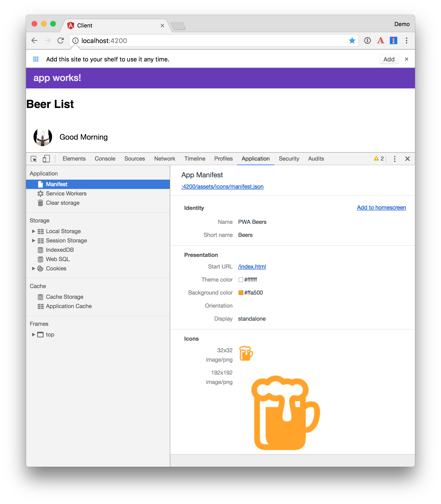

If you open Chrome developer tools > Network and enable offline, you'll notice the app still loads when the user is offline. _Yippee!_

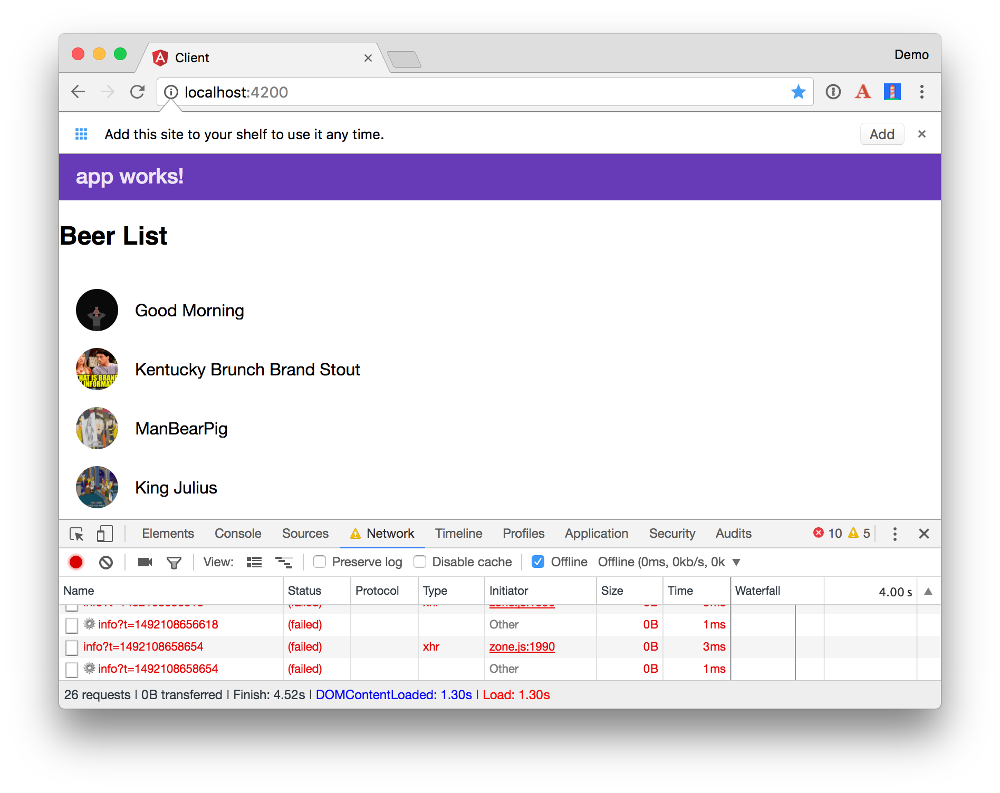

### Test with Lighthouse

Install the [Lighthouse extension for Chrome](https://chrome.google.com/webstore/detail/lighthouse/blipmdconlkpinefehnmjammfjpmpbjk) and click its icon to audit your app.

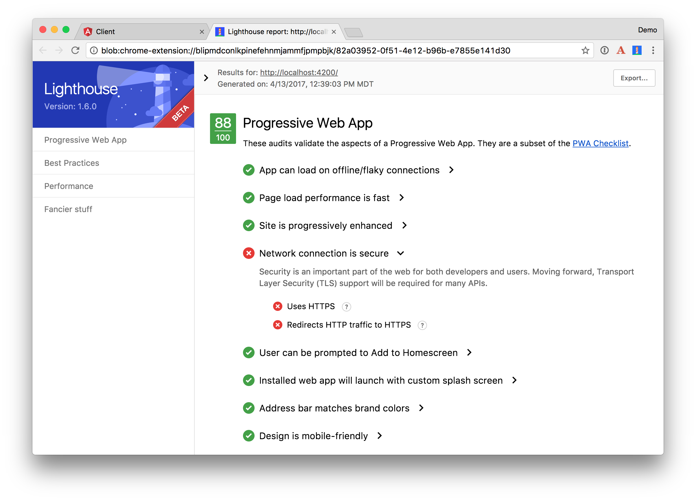

88 is a pretty good score, but you might notice that the app is not served over HTTPS. Deploying the app to a cloud provider can make this possible.

## Deploy to the cloud!

There are many cloud providers that support Spring Boot. For the Angular client, any web server will do since the app is full of static files after it's been built. However, there are a couple things you'll need to do to prepare the application for production.

First, modify `.angular-cli.json` to include the service worker.

```json
"assets": [
  "assets",
  "favicon.ico",
  "sw.js"
],
```

Modify `beer.service.ts` to use a different URL for production.

```typescript
getAll(): Observable<any> {
  return this.http.get('https://pwa-server.cfapps.io/good-beers')
    .map((response: Response) => response.json());
}
```

In the `client` directory, run the following command to build and optimize for production.

```bash
ng build -prod --aot
```

Since you hard-coded the paths to local files in `sw.js`, you'll need to update the paths to match the generated file names. Open `dist/sw.js` and change the `*.bundle.js` references in the `appShellFilesToCache` array to match the file names in the `dist` directory. Note that `styles.bundle.js` file reference should be changed to `style.*.bundle.css`. Later, I'll show you how to automate this with a script.

### Cloud Foundry

Now, let's look at how to deploy it on Cloud Foundry with [Pivotal Web Services](http://run.pivotal.io/). The instructions below assume you have an account and have logged in (using `cf login`).

**Deploy the client**

To deploy a static application to Cloud Foundry is very easy. In the `dist` directory, create an empty `Staticfile`.

```bash
touch Staticfile
```

Run the following commands to push the client, set it to force HTTPs, then start it.

**NOTE:** You may have to change the name from "pwa-client" to a unique name that's not being used.

```bash
cf push pwa-client --no-start
cf set-env pwa-client FORCE_HTTPS true
cf start pwa-client
```

Navigate to the deployed application in your browser (e.g. https://pwa-client.cfapps.io) and ensure it loads. If it does, you'll likely have a 404 in its console for when it tries to access the server.

**Deploy the server**

To deploy the Spring Boot backend, you first need to add CORS configuration for the new client. In `BeerController.java`, change `origins` to the location of the deployed client.

```java
@GetMapping("/good-beers")
@CrossOrigin(origins = "https://pwa-client.cfapps.io")
public Collection<Map<String, String>> goodBeers() {
```

Next, build the app and push it to Cloud Foundry. If you run the following commands from the `server` directory, all of this should happen for you.

```java
mvn clean package
cf push -p target/*jar pwa-server 
```

After deploying to Pivotal's Cloud Foundry, I ran a Lighthouse audit again and found my score to be 98/100. Not too shabby!

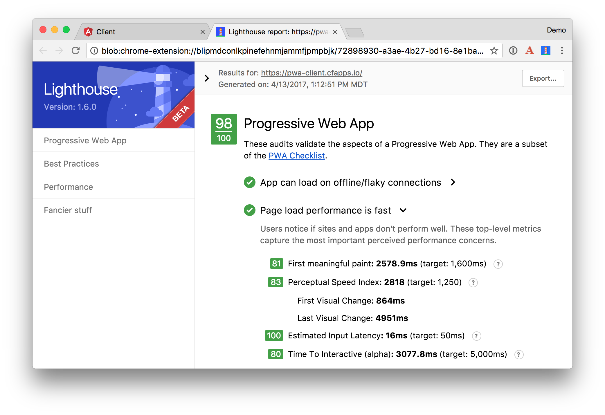

## Automation

There were quite a few steps involved to deploy this application and update files for production. For that reason, I wrote a [`deploy.sh`](https://github.com/oktadeveloper/spring-boot-angular-pwa-example/blob/master/deploy.sh) script that automates everything and uses random domain names for both servers. Note that it uses a [`sw.py`](https://github.com/oktadeveloper/spring-boot-angular-pwa-example/blob/master/sw.py) Python script to change the names of the script files in `dist/sw.js`. Kudos to [Josh Long](https://twitter.com/starbuxman) for helping create it.

If you'd like to use these scripts in your project, make sure to revert the changes for production URLs in `beer.service.ts` and `BeerController.java`.

## Source Code

You can find the source code associated with this article [on GitHub](https://github.com/oktadeveloper/spring-boot-angular-pwa-example). If you find any bugs, please file an issue, or post a question to Stack Overflow with the "okta" tag. Of course, you can always [ping me on Twitter](https://twitter.com/mraible) too.

## What's Next?

This article showed you to convert an existing Angular application into a progressive web application and deploy it to the cloud. 

One of the recommendations in the Lighthouse report was to [use HTTP/2](https://developers.google.com/web/tools/lighthouse/audits/http2). In a future post, I'll write about HTTP/2, what cloud providers support it, and how to deploy to the ones that do.

I'd like to give a big thanks to all the engineers that've been developing progressive web apps and documenting how to do it. It's new and exciting stuff, and may become the best way to write mobile applications in the future.